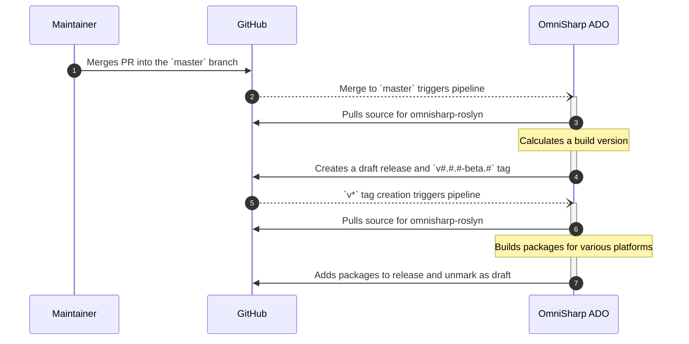
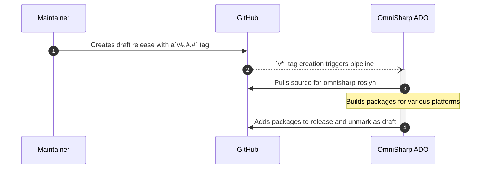

# How O# Releases Are Made

The OmniSharp [release pipeline](https://dev.azure.com/omnisharp/Builds/_build?definitionId=2) runs from the OmniSharp Azure DevOps instance. It is defined in [azure-pipelines.yml](/azure-pipelines.yml).

## Rolling Beta Builds

Merges into the master branch generate an empty draft GitHub release with a beta version tag. The tag created for the release then causes a build that uploads the packages.

## Official Builds

A maintainer creates an empty draft GitHub release with the appropriate version tag. The tag created for the release then causes a build that uploads the packages.

