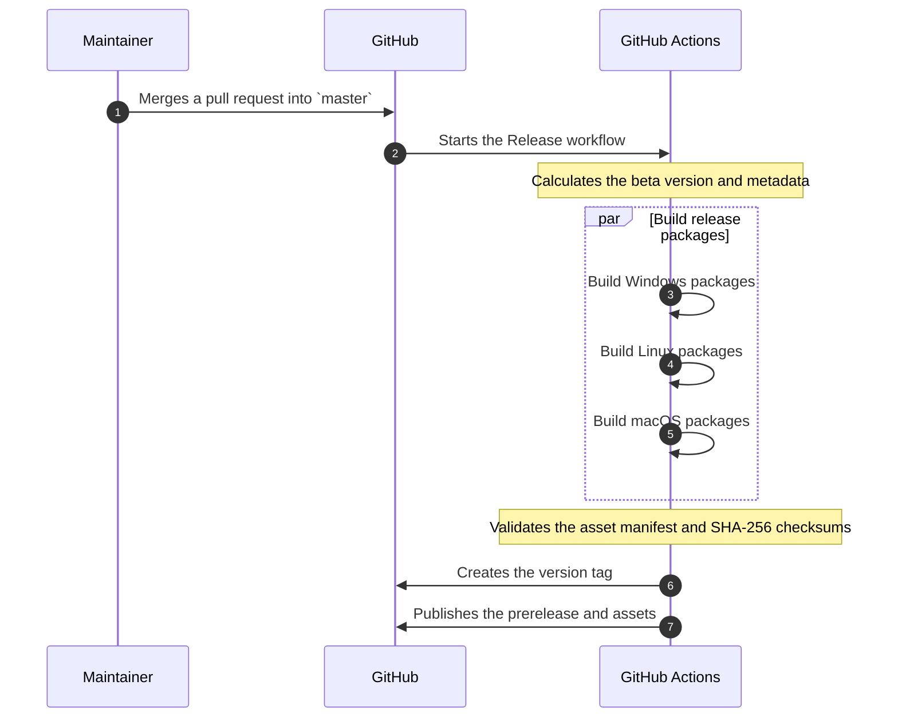

# How O# Releases Are Made

OmniSharp releases are built and published by the
[Release workflow](/.github/workflows/release.yml). The workflow builds the
Windows, Linux, and macOS packages from one commit, validates the complete
release asset set, and publishes the GitHub Release only after every platform
has succeeded.

The `production-release` GitHub environment should require maintainer approval.
The `beta-release` environment may remain unprotected so merges can publish
rolling beta releases automatically.

## Rolling Beta Builds

Every merge into `master` calculates the next GitVersion beta version, creates
release metadata once, builds all release packages, creates an annotated
`vX.Y.Z-beta.N` tag after package validation, and publishes a GitHub prerelease.
Release runs are serialized, so a newer merge cannot publish at the same time
as another release.

```mermaid
sequenceDiagram
  autonumber
  Maintainer ->> GitHub: Merges a pull request into `master`
  GitHub ->> GitHub Actions: Starts the Release workflow
  note over GitHub Actions: Calculates the beta version and metadata
  par Build release packages
    GitHub Actions ->> GitHub Actions: Build Windows packages
    GitHub Actions ->> GitHub Actions: Build Linux packages
    GitHub Actions ->> GitHub Actions: Build macOS packages
  end
  note over GitHub Actions: Validates the asset manifest and SHA-256 checksums
  GitHub Actions ->> GitHub: Creates the version tag
  GitHub Actions ->> GitHub: Publishes the prerelease and assets
```

If a run fails after creating its tag, rerun the failed workflow. The workflow
will reuse the tag only when it still points to the expected commit.

## Official Builds

Official releases are started from the GitHub Actions page:

1. Select the **Release** workflow and choose **Run workflow** on `master`.
2. Set **release-type** to `stable`.
3. Enter the version without a `v` prefix, for example `1.40.0`.
4. Approve the `production-release` deployment when prompted.

The workflow verifies that the selected commit belongs to `master`, creates the
version tag, builds and validates every package, and then publishes the release
as the latest stable version.

Use the `dry-run` release type to build and validate all packages without
creating a tag or GitHub Release. Pull requests that change release
infrastructure automatically run this mode.

## Release Assets

Expected release filenames are declared in
[`.github/release-assets.json`](/.github/release-assets.json). Linux owns the
generic Mono packages so that Linux and macOS cannot upload competing assets
with the same names. The assembly job rejects missing, unexpected, or duplicate
files and adds a `SHA256SUMS` file to every release. GitVersion metadata is
calculated once before the platform jobs and exported before invoking Cake, so
every platform embeds the same version as the release tag.

After publishing all assets, the workflow commits the published version without
the `v` prefix to `latestVersion.txt` on the `version` branch.

NuGet packages are retained as a GitHub Actions artifact. They are not currently
published to nuget.org or another package feed.
